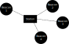

# I find the light

Server (station) for gathering readings from ESP32 sensors (beacons)


## What am I?

- I am a simple API
- I allow beacons to connect and post their readings - temperature and light (lux)
- I store the readings locally in an SQLite database
- I _will_ provide a GUI to allow for easier configuration and analysis of data (future)



## Terminology used

- **Beacon** - a sensor that takes readings from its environment and periodically broadcasts this
- **Station** - the server (this) that collects data from the beacons

## Installation

**Pre-requisites**

Make sure your system has;

- GIT
- [bun](https://bun.sh/)

**Linux**

This script will install the server to `/opt/iftl`, immediately register it as a service (via systemd), and start:

```shell
wget https://raw.githubusercontent.com/WeMakeMachines/i_find_the_light/refs/heads/main/install.sh -O - | sh
```

## Uninstalling

An uninstall script is [provided](./uninstall.sh)

## Configuring

All configuration takes place in the `.env` file.

See the [.env.sample](.env.sample) file for details.

**BEACON_SCHEDULE_START**
**BEACON_SCHEDULE_END**

- Expects a UNIX Timestamp in seconds

**UNIT**

- 1 = METRIC (default)
- 2 = IMPERIAL
