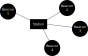

# I find the light

Server (station) for gathering readings from ESP32 sensors (beacons)

## What am I?

- I provide a REST API
- I provide a graphical interface for configuring surveys and viewing survey data
- I send survey configuration to connected [beacons](https://github.com/WeMakeMachines/i_find_the_light_beacon)
- I allow beacons to connect and post their readings
- I store the readings locally in an SQLite database
- [Demo](https://iftl.wemakemachines.com/demo)

## Terminology used

- **Beacon** - a sensor that takes readings from its environment and periodically broadcasts this
- **Station** - the server (this) that collects data from the beacons

## Setup

Requires git, [bun](https://bun.sh/)

1. `bun install`
2. `bun run build`
3. `bun start`

The admin panel can be viewed locally over port 3111, for example [http://localhost:3111](http://localhost:3111)

### Setting up a systemd service

There are a few scripts that can help with that;

- `create-systemd-service.sh` (assumes app is installed under `/opt/iftl`)
- `remove-systemd-service.sh`
